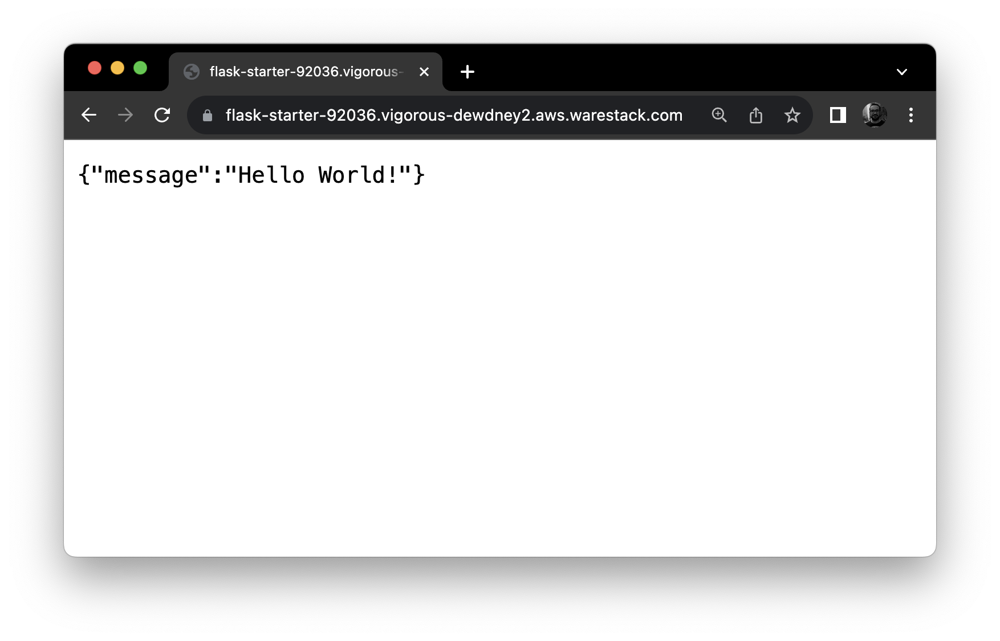

### Flask API Starter Seed

This starter seed provides a foundational structure for creating a Flask API that returns a "Hello, World!" response. The seed is designed to integrate seamlessly with Warestack's automated deployment systems, ensuring your API is up and running with minimal setup.

#### Flask seed information

Get started with Flask APIs in minutes. 



| Framework    | Python Flask                                                 |
| ------------ | ------------------------------------------------------------ |
| Level        | Starter to experiences                                       |
| Use case     | Hello world                                                  |
| Live demo    | https://flask-starter-92036.vigorous-dewdney2.aws.warestack.com |
| Requirements | [Python and pip installed](https://www.python.org/downloads/) |
| Publisher    | Warestack                                                    |

#### Launching the API

Follow these steps to get your Flask API started:

1. Navigate to the `flask-starter` directory within your project.

2. Set up your environment variables based on the instructions found under the [local development](#local-development) section.

3. Install the required packages by running the following command in your terminal:

```python
pip install -r requirements.txt
```

> Requirements files serve as a list of items to be installed by pip, when using `pip-install`. The `requirements.txt` includes:  `Flask` and `python-dotenv` libraries.

4. Initiate your server by running the following command in your terminal:

```python
python3 server.py
```

5. Visit your localhost at **[localhost:5000](http://localhost:5000/)** in your browser or API client, where you will see the `Hello, World!` message.

6. Use the [localhost:5000/healthz](http://localhost:5000/healthz) endpoint to check the health status of your API, which is a critical feature for the automation features of Warestack.

#### Customizing the seed

Let's see an example of developing a simple endpoint. Using your favorite IDE, navigate in the `app/routes` folder and edit or create following your application logic. Firstly create a new file called new.py inside the  `app/routes` folder using the following script.

```python
from flask import Blueprint, jsonify

new = Blueprint('root', __name__)

@new.route('/')
def info():
    return jsonify(message="This is a new endpoint!")
```

To run the Flask server use the following command:

* Unix, Linux or MacOS

```
$ export FLASK_APP=server
$ flask run
```

* Windows

```
> set FLASK_APP=server
> flask run
```

#### Dependencies

This seed is built on the robust and lightweight Flask framework:

- [Flask](https://flask.palletsprojects.com/en/3.0.x/): An expressive web framework that allows for the swift development of web applications with its easy-to-use syntax and powerful extensions.

#### Local development environment

To properly configure your development environment:

- Begin by creating a `.env` file, using `.env.example` as a blueprint.
- Customize the `.env` file's contents to align with your specific development requirements.

#### Containerizing your app

To containreize your application follow the next steps.

1. Create a `Dockerfile` with the following.

```dockerfile
FROM ubuntu

# Create app directory
WORKDIR /app

# Install app dependencies
RUN apt update
RUN apt install python3-pip -y
RUN pip3 install Flask

COPY . .

# OPTIONAL as the `-p` flag is used while running the container
EXPOSE 5000

CMD ["python3", "-m", "flask", "run", "--host=0.0.0.0"]
```

2. Run the following command to build your flask image.

```dockerfile
docker build -t flask .
```

3.  Run the container using the newly created image abd expose it to the port 5000.

```
docker run -d -p 5000:5000 flask
```

> `-d` run process in the background.

#### Automated Deployments with Warestack

To ensure full compatibility with Warestack's automated deployment processes, your Flask API must include a `healthz` endpoint. This endpoint is critical for Warestack to verify the service's operational status.

#### Engaging with the Community

We encourage interaction and collaboration within the community:

- Should you encounter any obstacles or have queries regarding the framework, do not hesitate to open an issue within the project's repository.
- Your contributions can shape the future of this starter framework. We welcome pull requests with open arms, whether it's to refine the existing setup or to introduce new features.
- Connect with us on [Discord](https://discord.gg/F26qxbgjHx).
